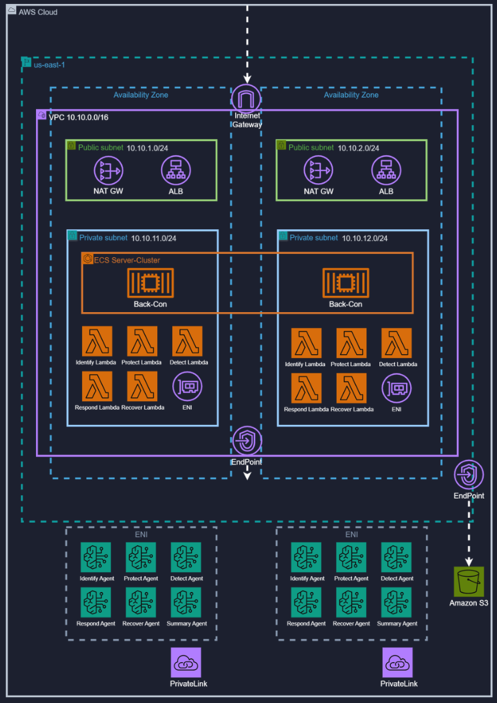

> AWS Cloud School Final Project (2025-05-15 ~ 07-11)

# 🛡️ AWS NIST Cybersecurity Framework Multi-Agent System


AWS Bedrock Agent 기반 NIST 사이버보안 프레임워크 자동 분석 시스템

---

## 1. 🎯 개요

이 솔루션은 AWS Bedrock Agent를 활용하여 고객의 AWS 환경을 NIST 사이버보안 프레임워크 5단계(IDENTIFY → PROTECT → DETECT → RESPOND → RECOVER)에 따라 자동으로 분석하고 보안 개선 방안을 제시합니다. 11개의 전문 Agent가 병렬로 실행되어 종합적인 보안 상태를 평가합니다.

---

## 2. 🏗️ 아키텍처

### 2.1 시스템 구성도



```
┌─────────────────────────────────────────────────────────────┐
│                      API Server (FastAPI)                    │
│  - 비동기 분석 요청 처리                                      │
│  - 백그라운드 작업 관리                                       │
│  - 실시간 로그 스트리밍                                       │
└─────────────────────────────────────────────────────────────┘
                              ↓
┌─────────────────────────────────────────────────────────────┐
│              NIST Workflow (LangGraph)                       │
│  - 11개 Bedrock Agent 오케스트레이션                         │
│  - 병렬/순차 실행 제어                                        │
│  - Trace 수집 및 분석                                         │
└─────────────────────────────────────────────────────────────┘
                              ↓
┌─────────────────────────────────────────────────────────────┐
│                  Bedrock Agents (11개)                       │
│                                                               │
│  IDENTIFY (4개 병렬)                                          │
│  ├─ identify-agent-01: 보안 상태 식별                        │
│  ├─ computing-agent: 컴퓨팅 서비스 보안                      │
│  ├─ storage-agent: 스토리지 서비스 보안                      │
│  └─ db-agent: 데이터베이스 서비스 보안                       │
│                                                               │
│  PROTECT (2개 병렬)                                           │
│  ├─ protect-agent-01: IAM, KMS, Secrets, VPC                │
│  └─ protect-agent-02: ACM, WAF, Network Firewall            │
│                                                               │
│  DETECT (2개 병렬)                                            │
│  ├─ detect-agent-01: CloudTrail, CloudWatch                 │
│  └─ detect-agent-02: GuardDuty, Inspector, Macie            │
│                                                               │
│  RESPOND (1개)                                                │
│  └─ respond-agent-01: Step Functions 기반 대응               │
│                                                               │
│  RECOVER (1개)                                                │
│  └─ recover-agent-01: CloudFormation, EBS Snapshots         │
│                                                               │
│  SUMMARY (1개)                                                │
│  └─ summary-agent: 최종 보고서 생성                          │
└─────────────────────────────────────────────────────────────┘
                              ↓
┌─────────────────────────────────────────────────────────────┐
│              Lambda Functions (각 Agent별)                   │
│  - 고객 AWS 자격증명으로 리소스 조회                         │
│  - 보안 상태 데이터 수집 및 분석                             │
│  - Bedrock Agent에 결과 반환                                 │
└─────────────────────────────────────────────────────────────┘
```

### 2.2 🌐 인프라 설계

#### VPC 구성
| 구성요소 | 상세 |
|----------|------|
| VPC | 10.0.0.0/16 (us-east-1) |
| Private Subnet | 2개 (Lambda 실행 환경) |
| Public Subnet | 2개 (NAT Gateway 배치) |
| NAT Gateway | 2개 (고가용성) |
| Internet Gateway | 1개 |
| VPC Endpoint | Bedrock Agent Runtime |
| Security Groups | Lambda, VPC Endpoint |

#### Lambda 배포
- Private Subnet에서 실행
- 각 Agent별 전용 Lambda 함수
- Python 런타임
- VPC Endpoint로 Bedrock 접근
- NAT Gateway로 AWS API 호출

#### Bedrock Agent
- 11개 Agent
- CloudFormation 배포
- Foundation Model: Claude Opus 4
- Trace 활성화
- 세션 속성으로 자격증명 전달

### 2.3 🖥️ 백엔드 구성

#### API Server (FastAPI)
- 비동기 보안 분석 요청 처리
- 백그라운드 작업 관리 및 상태 추적
- 실시간 로그 스트리밍 API 제공
- RESTful API 엔드포인트: `/analysis`, `/analysis/{task_id}/status`, `/analysis/{task_id}/logs`, `/analysis/{task_id}/result`

#### Workflow 오케스트레이션 (LangGraph)
- NIST 5단계 워크플로우 그래프 정의
- 11개 Bedrock Agent 순차/병렬 실행 제어
- Agent 간 상태 전달 및 결과 집계

#### Bedrock Agent Trace
- Agent 호출 시 `enableTrace=True`로 Trace 활성화
- 스트리밍 응답에서 Trace 이벤트 실시간 수신
- 추론 과정(Rationale), 토큰 사용량, 처리 시간 파싱
- Action Group 호출 및 Lambda 실행 결과 추적

#### 비동기 작업 처리
- FastAPI BackgroundTasks를 통한 비동기 실행
- 메모리 기반 작업 상태 저장소
- Task ID 기반 작업 추적
- 실시간 로그 캡처 및 제공

### 2.4 🔒 보안 설계

#### 자격증명 관리
- 고객 AWS 자격증명은 API 요청 시 전달
- Bedrock Agent 세션 속성으로 Lambda에 안전하게 전달
- 메모리에만 저장, 영구 저장소 미사용
- Lambda 실행 시에만 임시 사용

#### 네트워크 격리
- Lambda 함수는 Private Subnet에서 실행
- VPC Endpoint를 통한 Bedrock Agent Runtime 접근
- NAT Gateway를 통한 AWS API 호출
- 인터넷 직접 노출 차단

#### 최소 권한 원칙
- 각 Lambda 함수는 필요한 최소 권한만 부여
- Bedrock Agent Role과 Lambda Execution Role 분리
- 읽기 전용 권한으로 고객 리소스 조회

---

## 3. ✨ 주요 기능

- **NIST 5단계 자동 분석**: IDENTIFY → PROTECT → DETECT → RESPOND → RECOVER → SUMMARY
- **11개 전문 Agent**: 각 보안 영역별 특화된 분석 Agent
- **병렬 처리**: IDENTIFY 4개, PROTECT 2개, DETECT 2개 Agent 병렬 실행
- **실시간 Trace 모니터링**: Bedrock Agent 추론 과정, 토큰 사용량, 처리 시간 추적
- **비동기 API**: 백그라운드 작업으로 즉시 응답, 실시간 로그 조회

---

## 4. 🔍 NIST 분석 프로세스

### IDENTIFY (식별) - 4개 Agent 병렬 실행
- **identify-agent-01**: Security Hub, Config, Trusted Advisor, Systems Manager 통합 분석
- **computing-agent**: EC2, ECS, EKS, Lambda, ECR 보안 상태
- **storage-agent**: S3, EBS, EFS, Backup 보안 상태
- **db-agent**: RDS, DynamoDB 보안 상태

### PROTECT (보호) - 2개 Agent 병렬 실행
- **protect-agent-01**: IAM, KMS, Secrets Manager, VPC 보안 설정
- **protect-agent-02**: ACM, WAF, Network Firewall, PrivateLink, Transit Gateway

### DETECT (탐지) - 2개 Agent 병렬 실행
- **detect-agent-01**: CloudTrail, CloudWatch, CloudWatch Logs 분석
- **detect-agent-02**: GuardDuty, Inspector, Macie, Detective 위협 탐지

### RESPOND (대응) - 1개 Agent
- **respond-agent-01**: Step Functions 기반 자동 대응 워크플로우

### RECOVER (복구) - 1개 Agent
- **recover-agent-01**: CloudFormation 스택, EBS 스냅샷 복구 상태

### SUMMARY (요약) - 1개 Agent
- **summary-agent**: 전체 분석 결과 종합 및 개선 방안 제시

### 병렬 처리 전략
- IDENTIFY 단계: 4개 Agent를 2단계로 나누어 병렬 실행 (identify-01 + computing, storage + db)
- PROTECT 단계: 2개 Agent 동시 병렬 실행
- DETECT 단계: 2개 Agent 동시 병렬 실행
- RESPOND, RECOVER, SUMMARY: 순차 실행

---

## 5. 📁 프로젝트 구조

```
AWS-NIST-Security-Agents-Framework/
├── api-server/                    # FastAPI 서버
│   ├── app.py                     # 메인 API 서버
│   ├── workflow.py                # NIST 워크플로우 로직
│   ├── models.py                  # Pydantic 모델
│   └── requirements.txt
│
├── terraform/                     # VPC 인프라
│   ├── main.tf
│   ├── vpc.tf
│   ├── security_groups.tf
│   ├── endpoints.tf
│   └── outputs.tf
│
├── identify/                      # IDENTIFY 단계 (4개 Agent)
│   ├── identify-agent-01/
│   │   ├── cloudformation/
│   │   └── lambda/
│   ├── computing-agent/
│   ├── storage-agent/
│   └── db-agent/
│
├── protect/                       # PROTECT 단계 (2개 Agent)
│   ├── protect-agent-01/
│   └── protect-agent-02/
│
├── detect/                        # DETECT 단계 (2개 Agent)
│   ├── detect-agent-01/
│   └── detect-agent-02/
│
├── respond/                       # RESPOND 단계 (1개 Agent)
│   └── respond-agent-01/
│
├── recover/                       # RECOVER 단계 (1개 Agent)
│   └── recover-agent-01/
│
├── summary/                       # SUMMARY 단계 (1개 Agent)
│   └── cloudformation/
│
└── docs/                          # 문서 및 다이어그램
    └── architecture.png
```
